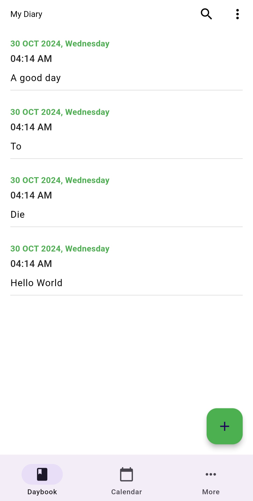
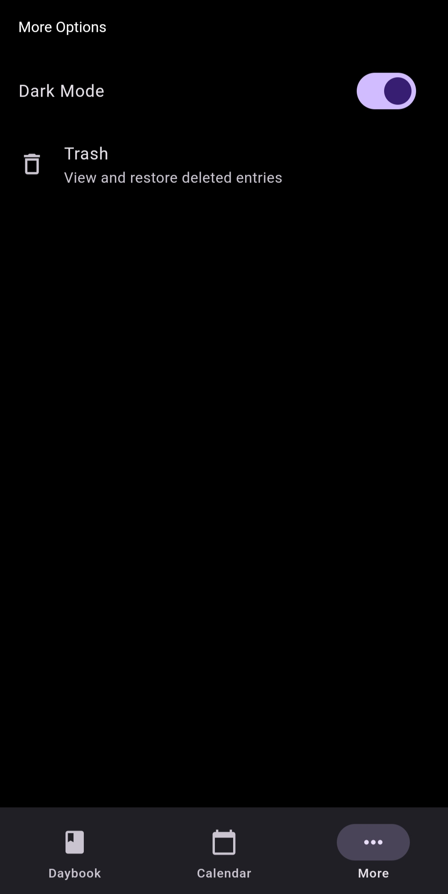
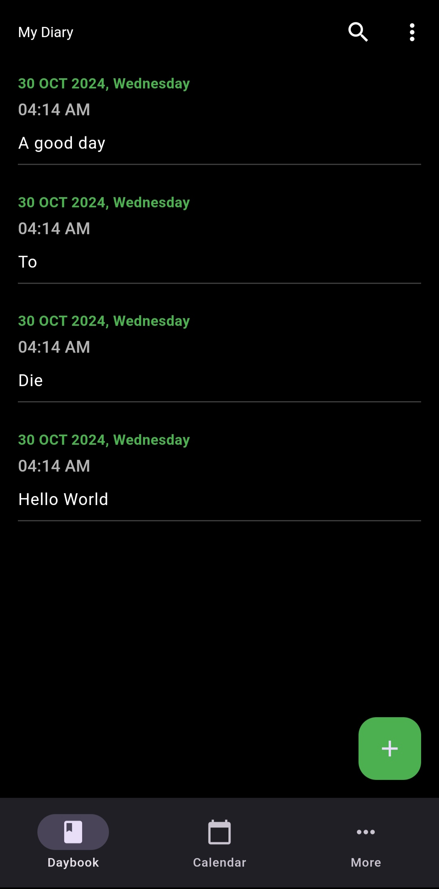
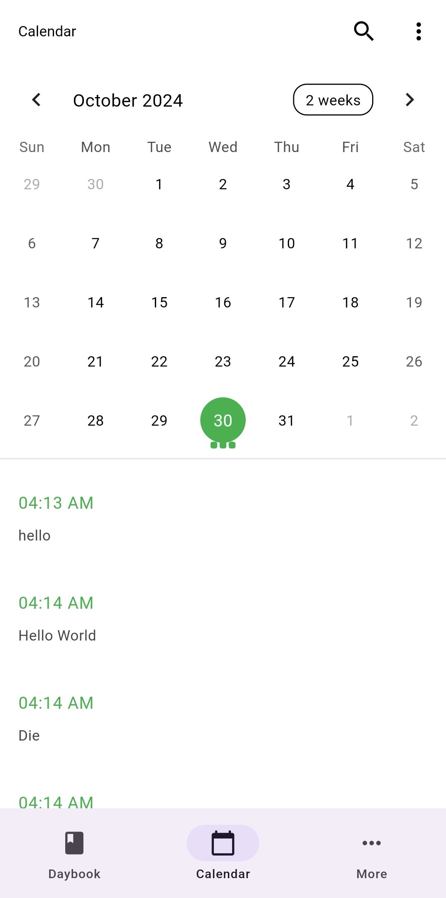

# Dear Diary

## Overview

Dear Diary is a Flutter-based application that allows users to keep track of their thoughts, experiences, and daily events in a simple and user-friendly interface. This app aims to provide a digital space for personal reflection and creativity.

## Features

- Create, edit, and delete diary entries
- Organize entries by date
- Search functionality to find specific entries
- Customizable themes
- Offline support

## Screenshots
<table>
  <tr>
    <td>Home Screen</td>
     <td>More Screen</td>
     <td>Trash Box</td>
  </tr>
  <tr>
    <td></td>
    <td></td>
    <td></td>
  </tr>
  <tr></tr>
  <tr>
    <td>Dark Home Screen</td>
     <td>Calendar Screen</td>
     <td>Another Calendar Screen</td>
  </tr>
  <tr>
    <td></td>
    <td></td>
    <td></td>
  </tr>
 </table>


 |  |
Trash Screen

Dark Home Screen

Calendar Screen

Another Calendar Screen


## Getting Started

### Prerequisites

- Flutter SDK (latest stable version)
- Dart SDK
- An IDE such as Android Studio or Visual Studio Code
- Emulator or physical device for testing

### Install flutter 
    ```bash
    sudo snap install flutter --classic
    flutter --version
    
    flutter doctor
    ```
### Installation

1. Clone the repository:
    ```bash
    git clone https://github.com/yourusername/dear_diary.git
    ```
2. Navigate to the project directory:
    ```bash
    cd dear_diary
    ```
3. Install the dependencies:
    ```bash
    flutter pub get
    ```
4. Run the app:
    ```bash
    flutter run
    ```

## Contributing

Contributions are welcome! Please follow these steps to contribute:

1. Fork the repository.
2. Create a new branch:
    ```bash
    git checkout -b feature-branch
    ```
3. Make your changes.
4. Commit your changes:
    ```bash
    git commit -m 'Add new feature'
    ```
5. Push to the branch:
    ```bash
    git push origin feature-branch
    ```
6. Create a pull request.
